<!--
  Profile README for @kavatana.
  This file and header.svg must live in a repo named exactly kavatana/kavatana,
  and that repo must be PUBLIC — GitHub renders the profile README only from a
  public repo whose name matches the username. The relative ./header.svg path
  animates because GitHub serves the raw SVG.
-->

  

  
  
  

---

### About

Founder-engineer in **Phnom Penh**, building products for Cambodia — a market most
software is not designed for. Software Engineering student, shipping in the open
where the work allows it.

> Evidence over claims. If a thing is live, it is linked. If it is not, it says so.

### Stack

  
   
  

<em>Built for the market I am from.</em>

