<!--
  Profile README for @kavatana.
  This file, header.svg, and brain.svg must live in a repo named exactly
  kavatana/kavatana, and that repo must be PUBLIC — GitHub renders the profile
  README only from a public repo whose name matches the username. The relative
  SVG paths animate because GitHub serves the raw files.

  Every status line below is copied from the evidence labels the portfolio and
  the CHNAI LAB org profile already publish. Change it there first, then here.
-->

  

  
  
  
  

  

## At a glance

| 🌱 Product tracks | 🏛️ Studio | 🧠 On the map | 🎓 Studying |
|:---:|:---:|:---:|:---:|
| **06** | **01** | **22 things** | **Year 1** |
| Chomkar · PHSAROS · Svaeng Yul BayonHub · Sat Digital · Vantrex | CHNAI LAB student-run, Cambodian | products, studio, skills, agents, current focus | Software Engineering BELTEI International University |

  

## About

Year 1 Software Engineering student in Cambodia, training like a product engineer in the open. I build Cambodia-first products with AI-native workflows, then say plainly what is shipped, what is simulated, and what is still being validated.

> Ship working systems, document the tradeoffs,
> protect user trust, build with AI agents.

## Now

- **Chomkar.com** — co-founder; B2B pre-harvest coordination for buyers, farmers, and co-ops. Live pre-pilot.
- **CHNAI LAB** — the student-run product studio I lead: six product tracks, owned products first, bounded client work second.
- **Studio OS** — my private operator brain: a workspace ledger, a cached map of everything I run, and a session hook that opens every AI agent session already knowing my projects and how I work. The public map lives on [kavatana.me](https://www.kavatana.me).
- **Studies** — Software Engineering at BELTEI International University; Year 1 English at IFL.
- **Angkor Byte** — web system and digital project support, learning professional workflow and Cambodia-Japan collaboration.

## What I run

Status lines are the evidence boundary as it exists now, not a claim of traction or readiness.

| Track | Direction | Where it stands |
| --- | --- | --- |
| [**Chomkar**](https://www.kavatana.me/projects/chomkar) | Agricultural market access | Live pre-pilot; demand, price, and availability claims stay human-reviewed |
| [**PHSAROS**](https://www.kavatana.me/projects/phsaros) | SME operations: POS, inventory, customers, expenses | Live core; operator validation owed, ownership attribution under written review |
| [**Svaeng Yul**](https://www.kavatana.me/projects/svaeng-yul) | Healthcare QCM practice for medical and nursing students | Private preview; instructor review and mobile validation open |
| [**BayonHub**](https://www.kavatana.me/projects/bayonhub) | Opportunity infrastructure for Cambodian tech students | Full MVP branch under review, unmerged and undeployed |
| **Sat Digital** | Community cybersecurity for Telegram groups and sites | Working local prototype on synthetic fixtures only |
| **Vantrex** | Trading decision support | Pre-launch; ownership and legal review open |
| [**Studio OS**](https://www.kavatana.me/projects/studio-os) | Personal operating brain, two modes | Public demo live; private operator local |
| [**kavatana.me**](https://www.kavatana.me) | Public proof of work | Live; every claim checked against its repository |
| [**Twenty-five sites**](https://github.com/kavatana/twenty-five-sites) | Design lab: 25 self-contained sites, no framework, no build | Public |

## How I work

<table>
<tr>
<td width="33%" valign="top">

**Evidence before status**

Deployed, local, simulated, degraded, and planned work are named as such. A demo is not a launch.

</td>
<td width="33%" valign="top">

**People stay accountable**

A person owns product judgment, verification, review, and the decision to ship.

</td>
<td width="33%" valign="top">

**AI stays bounded**

Agents get scoped context, never secrets, and their work stays reviewable.

</td>
</tr>
</table>

## Stack

Only what a shipped or in-review project on kavatana.me actually uses.

<table>
<tr>
<td align="center" width="33%">

**Frontend & product**

</td>
<td align="center" width="33%">

**Backend & data**

</td>
<td align="center" width="33%">

**Cloud, delivery & AI**

</td>
</tr>
</table>

## Activity

Most product source lives in private repositories under [CHNAI LAB](https://github.com/chnai-lab) and my own account, so the public graph shows the rhythm, not the volume.

  
  

  

  

  

<em>Building for the market I am from.</em>

