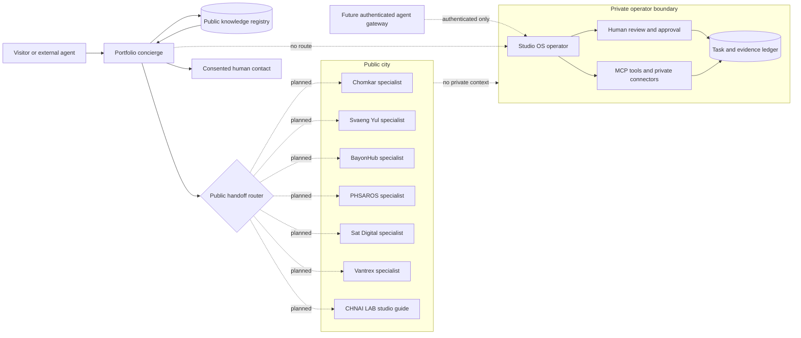

# AI Concierge Architecture

## Status

**Current:** the portfolio ships a client-side, deterministic concierge grounded
in committed public content. It can answer, cite, and route. It makes no model
call, invokes no remote tool, and receives no private Studio OS context.

**Planned:** a model-backed public gateway and product-specialist agents may be
added only after their retrieval, citation, authentication, consent, evaluation,
and audit boundaries are implemented.

This distinction matters. A chat interface is not evidence of a safe or capable
agent, and a future architecture must not be described as live behavior.

## Product Intent

Visitors should not need to discover the site's information architecture before
they can understand Ka Vatana's work. The concierge accepts a question, finds
the closest approved public topic, answers concisely, and links to the source
that supports the answer.

The same interaction model can later sit above each product, but every product
agent must remain a specialist with one bounded domain. The portfolio concierge
routes across the city; it does not inherit every district's data or authority.

## City Map



The dashed "no route" boundary is intentional. Public visitor input cannot be
used as an instruction channel into the private operator.

## Current Portfolio Node

The first node consists of:

- `content/concierge.json`: approved fixed answers, intent phrases, citations,
  and follow-up prompts.
- `content/projects/*.json`: project-specific status, stack, role, evidence,
  deployment, learning, and next-step fields.
- `content/agent-city.json`: the shared city layers, districts, task states, and
  human gates.
- `lib/concierge-core.mjs`: deterministic matching and structured answer
  rendering.
- `components/PortfolioConcierge.vue`: accessible visitor interaction.
- `public/llms.txt`: a concise machine-readable orientation path for external
  agents.

Conversation state is limited to `sessionStorage` in the visitor's tab. The
current implementation does not transmit or persist questions outside that
browser session.

## Authority Model

| Layer | Reads | May do | Must not do |
| --- | --- | --- | --- |
| Portfolio concierge | Approved public portfolio content | Answer, cite, navigate, offer contact | Read private data, call tools, impersonate Ka, invent claims |
| Product specialist | One approved product knowledge domain | Explain and route within that product | Cross product boundaries or infer unavailable user state |
| Authenticated product agent | Explicitly authorized user and product context | Prepare or perform separately approved low-risk tasks | Expand its own scope or reuse credentials outside the task |
| Studio OS operator | Owner-approved private context and connectors | Retrieve, prepare, verify, and propose work | Expose private context publicly or bypass human gates |
| Human owner | All explicitly granted context | Approve consequential decisions | Transfer accountability to an agent |

Merges, deployments, access changes, external messages, destructive operations,
security response, payments, financial decisions, and trading actions remain
human-controlled.

## Answer Contract

Every public answer must contain:

1. A result grounded in an approved public source.
2. Zero invented user, revenue, performance, deployment, security, or traction
   claims.
3. One or more source links when a precise answer is available.
4. A bounded fallback when the registry cannot support the question.
5. No private path, token, connector output, internal prompt, or unpublished
   strategy.

The concierge speaks about Ka in the third person. It is a guide, not a digital
impersonation.

## Future Gateway Contract

A model-backed gateway should accept only a small public envelope:

```json
{
  "question": "What proves Ka can ship a product?",
  "page": "/projects/chomkar",
  "locale": "en",
  "conversationId": "ephemeral-public-id"
}
```

Its response should be structured:

```json
{
  "answer": "Grounded answer text",
  "citations": [
    {
      "label": "Chomkar case study",
      "url": "https://kavatana.me/projects/chomkar"
    }
  ],
  "confidence": "grounded",
  "handoff": null
}
```

The gateway must retrieve from an allowlisted public index. Private Studio OS
memory and connectors are not retrieval sources for public requests.

## Interoperability Direction

The system separates three concerns:

- **Site conversation:** the visitor-facing concierge UI.
- **Agent-to-tool access:** MCP may connect authenticated operator agents to
  focused tools, with the host enforcing authorization and context isolation.
- **Agent-to-agent handoff:** A2A may later expose discoverable product agents,
  skills, and task states after real HTTPS endpoints and authentication exist.

`public/agent-directory.json` is currently a project directory, not an A2A Agent
Card and not a claim of protocol compliance. A standard
`/.well-known/agent-card.json` must not be published until a conforming service
actually exists.

## Product Rollout

1. **Portfolio:** public evidence discovery, citations, navigation, and contact.
2. **Chomkar:** Khmer-first product and lesson support. It must not invent
   demand, price, quantity, harvest dates, safety, certification, sales, or
   guarantees.
3. **Svaeng Yul:** learning-path and lesson retrieval. It must not fabricate
   course completion, credentials, or student progress.
4. **BayonHub:** verified opportunity discovery. It must not invent openings,
   employers, deadlines, eligibility, or acceptance.
5. **PHSAROS:** documentation and operating support first. Any staff, inventory,
   or financial write requires authentication, confirmation, and an audit
   record.
6. **Sat Digital:** defensive support and incident intake. It must not receive
   broad credentials or perform offensive, destructive, or unreviewed security
   actions.
7. **Vantrex:** product education and data explanation. It must not promise
   returns, present signals as certainty, or execute trades without separately
   reviewed controls.
8. **CHNAI LAB:** routes people and tasks to the correct product team while
   preserving repository ownership and review rules.

## Task And Handoff States

Simple public questions remain messages. Work that outlives one response should
become a traceable task:

`discovered -> answered | input-required | auth-required -> human-review -> completed | rejected | failed`

Each new refinement becomes a new task linked to prior evidence rather than
silently rewriting a completed record.

## Evaluation Gate

A model-backed or tool-using node is not ready until it passes:

- grounded-answer and citation coverage
- unknown-question refusal
- cross-product and public/private boundary tests
- direct and indirect prompt-injection cases
- sensitive-data and credential-shape checks
- permission, confirmation, cancellation, and failure-path tests
- keyboard, screen-reader, mobile, and reduced-motion checks
- latency, cost, and rate-limit budgets
- human review of tone, claims, and localized copy

The repository's deterministic concierge tests remain the baseline even after a
model is introduced. A model should improve language flexibility, not remove
the predictable fallback path.
