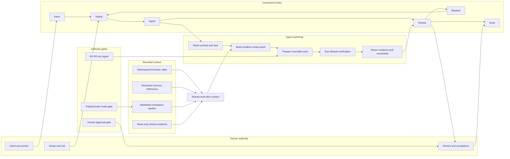

# Studio OS: Human-Agent Control Plane

Studio OS is my private AI-native command center for personal focus, project
context, and product-team operations. Its public demo shows the interaction
model with neutral data. Its private operator adds bounded context retrieval and
read-only evidence without handing consequential authority to an agent.

This case study explains the system contract. It intentionally does not publish
private source, personal memory, local paths, connector output, credentials, or
unreleased product strategy.

## Status

| Surface             | Current state                                        | Boundary                                                       |
| ------------------- | ---------------------------------------------------- | -------------------------------------------------------------- |
| Public demo         | Live, neutral, local-first interaction model         | Synthetic connector data; private workspace routes fail closed |
| Private operator    | Owner-controlled review branch                       | Bounded workspace evidence and read-only GitHub context        |
| Agent execution     | Guarded preparation and a small safe-check allowlist | No silent merge, deploy, destructive action, or external write |
| Hosted private mode | Not deployed                                         | Authentication and authorization are required first            |

The verification evidence below reflects the prospective merge of two private
review branches. It is not a claim that every private-operator capability is
available in the public deployment.

## The Problem

Personal and product work is distributed across daily focus, project
repositories, GitHub review queues, decisions, and long-running context. A
useful AI-native system must make that work easier to resume without creating a
second source of truth or giving an agent unlimited access.

The hard part is not generating another answer. The hard part is preserving:

- human ownership of priority, risk, and acceptance;
- enough context for an agent to work without exposing the whole workspace;
- evidence that survives a chat reset or model change;
- explicit public and private operating modes;
- honest degraded behavior when context or connectors are unavailable.

## Control Plane



The Command Center is a control plane, not a replacement for GitHub. GitHub
remains the durable record for issues, code, pull requests, checks, and accepted
changes. Studio OS owns current focus, routing, evidence summaries, and session
handoffs.

## Human and Agent Lanes

| Human lane                                      | Agent lane                                                  |
| ----------------------------------------------- | ----------------------------------------------------------- |
| Defines the outcome and what is not in scope    | Reads the task, repository contract, and current evidence   |
| Chooses priority and accountable owner          | Builds the smallest context pack needed for one outcome     |
| Decides whether risk is acceptable              | Prepares reversible work in a focused branch or worktree    |
| Reviews behavior, claims, and uncertainty       | Runs allowed checks and records exact results               |
| Accepts, rejects, redirects, merges, or deploys | Returns a handoff; it does not silently accept its own work |

A shared work item carries a title, project, lane, human owner, agent route,
risk signal, next action, evidence, and approval gate. This keeps coordination
portable without pretending that an agent session is durable memory.

## Work-Item State Machine

- **Inbox:** captured locally or imported as an attention signal; still needs a
  human decision.
- **Ready:** human-scoped with an owner and next proof.
- **Agent:** delegated preparation is active or waiting for evidence.
- **Review:** an agent result or GitHub change needs a human decision.
- **Blocked:** evidence, context, or authority is missing; intervention is
  explicit instead of hidden in chat.
- **Done:** a human accepted the proof or shipped result.

The R0-R3 value is a routing signal, not a security certification:

- **R0:** no approval pressure detected for the current local item.
- **R1:** reversible or medium-risk work needs extra care.
- **R2:** explicit approvals or several risk signals are present.
- **R3:** the runbook is blocked and requires owner intervention.

## Context Boundary

The private operator does not index every file. It retrieves bounded evidence
from registered projects and keeps context layers separate:

| Layer             | Permitted use                                                 | Boundary                                                          |
| ----------------- | ------------------------------------------------------------- | ----------------------------------------------------------------- |
| Browser state     | Focus, local captures, selected proof, synthetic demo traces  | Namespaced local storage with defensive parsing                   |
| Workspace readers | Shallow docs, manifests, declared scripts, and Git state      | Allowlisted roots, timeouts, and generated/secret-path exclusions |
| Private memory    | Reviewed identity, decisions, and continuity references       | Local, ignored, size-bounded, and unavailable in public demo mode |
| GitHub adapter    | PRs awaiting review, unassigned issues, and stale branches    | Read-only query with cache and labeled fallback data              |
| Safe checks       | `npm run typecheck`, `lint`, `test`, or `build` when declared | Exact allowlist, bounded runtime, and captured output tail        |

The handoff contains pointers, current decisions, evidence, and uncertainty. It
does not contain passwords or raw tokens.

## Public Demo Boundary

The public build is a separate operating mode, not the private operator with
hidden navigation:

1. Neutral demo content replaces personal and private product context.
2. Live GitHub access stops before token resolution and returns labeled demo
   evidence.
3. Six private workspace routes return a stable `PRIVATE_OPERATOR_ONLY`
   response before dynamically loading private operator modules.
4. The public Command Center does not request the private workspace map and
   disables delegation and safe-check execution at the UI boundary.
5. JavaScript source maps are removed from the deployable build.
6. A build-output scan checks a declared private-marker set, credential shapes,
   and private-vault traces.

That scan is a finite defense against known leakage paths. It is not proof that
the system contains zero private information under every possible threat.

## Failure Behavior

- Missing workspace paths produce explicit missing or blocked states.
- Missing GitHub credentials produce labeled demo data, not invented live data.
- Unsupported commands are blocked rather than passed to a shell.
- A failed or timed-out safe check returns status and bounded output evidence.
- An agent result remains unreviewed until a human marks it useful, needing a
  fix, or shipped.
- Public requests for private workspace capabilities fail closed.

## Verification Evidence

Evidence snapshot: 2026-07-19, prospective private review-branch merge.

| Check                                                         | Result                                                                |
| ------------------------------------------------------------- | --------------------------------------------------------------------- |
| Repository, private-vault, and personality-profile invariants | Passed                                                                |
| Dependency audit                                              | 0 vulnerabilities                                                     |
| ESLint and strict TypeScript                                  | Passed                                                                |
| Next.js public-demo build                                     | 29 pages generated                                                    |
| Build privacy scan                                            | Passed across 746 text build artifacts                                |
| Private workspace API boundary                                | 6 guarded routes passed runtime checks                                |
| Mobile public-demo audit at 390x844                           | HTTP 200; no root overflow; 24 effective targets with none below 44px |
| Browser runtime                                               | No console errors, page errors, failed requests, or error responses   |

The repository verification command is:

```bash
npm run verify
```

## Tradeoffs

- Local-first browser state is immediate and private, but does not provide
  built-in cross-device synchronization.
- Bounded retrieval is less complete than indexing the whole machine, but it is
  easier to explain, audit, and stop.
- A read-only GitHub adapter provides useful team awareness before write
  automation, but humans still perform routine external updates.
- One codebase with explicit public/private modes reduces duplication, but it
  requires deterministic guards and output scanning to prevent drift.
- A small safe-check allowlist is less flexible than arbitrary shell access,
  but its authority is visible and testable.

## What This Does Not Claim

Studio OS is not autonomous, not a production security product, and not a
hosted multi-user private operator. It does not guarantee privacy, correct
prioritization, deployment safety, business outcomes, or agent correctness.

Humans retain credentials, access changes, merges, deployments, destructive
operations, production data, billing, legal commitments, personnel decisions,
security response, cyber activity, and financial or trading actions.

## Next Engineering Step

Add authentication and authorization before any hosted private-operator
deployment. After that, test connector and permission failures with redacted
fixtures, add an auditable approval model for each external write, and keep the
public demo unable to activate private capabilities.
